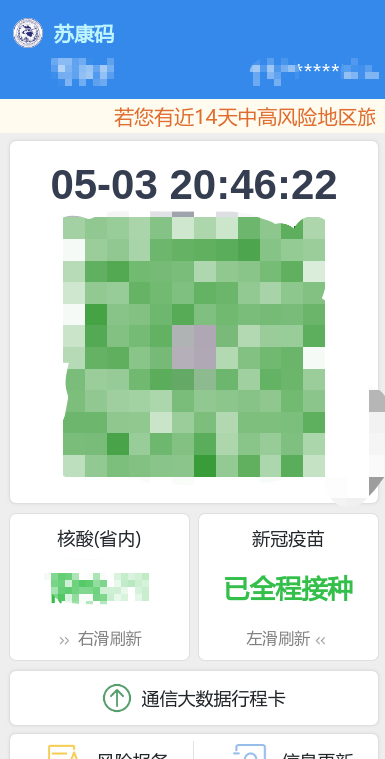
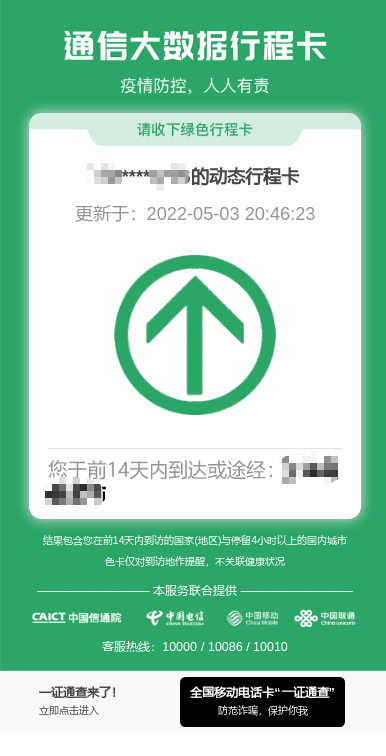

# NJU-admission-report
或许用于简化NJU计算机系走读生每日入校申请
## 说明
此项目纯属娱乐，仅供api学习
## 免责声明
请务必保管好苏康码个人token，如因token泄露造成损失，本项目概不负责！
由于大数据行程卡必须输入手机验证码，故使用“虚拟截图”（截图源自官网，但数据为自定义），如离开南京，请自觉手动申报。如造成损失，本项目概不负责！
## 更新
- 2022.5.3 更新了自动获取苏康码和行程码截图
- 2022.5.4 更新了上传图片自动命名
##  使用方法
1. 将本项目 Fork 到自己的仓库。
2. 进入苏康码网页链接 `https://scm.szgaj.cn/wjw/health_skm.html?v=1.1`，查询苏康码，查询后会跳转到新的网页链接，复制链接中的`token`字段（注意不需要`uuid`)
   - 例如`https://jsstm.jszwfw.gov.cn/jkmIndex.html?token=aaaaa(复制的区域)&uuid=abcdefg`,复制`token=`后到`&uuid`之前的内容`aaaaa`
3. 打开自己 Fork 之后的仓库，进入`Settings`选项，点击`Secret`，并选择`New Repository Secret`。依次添加以下变量：
    - `username`: 学号
    - `password`: 南京大学统一认证的密码
    - `name`: 姓名+学号，对应表单的“人员”,姓名学号之间加空格（例如：张三 MG12345678）
    - `phone`: 手机号，用于行程码截图
    - `skm_token`: 苏康码个人token，用于苏康码截图(2中复制的内容)
4. 回到 Action 选项卡，重新运行 Action，或者静待自动打卡。
5. 项目默认是在 5:00（北京时间13:00）自动打卡，可以根据需要修改 .github/workflows/report.yml 中 cron 项。`schedule:- cron: '0 5 * * *`字段使用UTC时间，北京时间快8小时。5个参数分别对应`minute、hour、day(month)、month、day(week)`，一般修改第二个参数（5对应北京时间13点）。具体参考https://crontab.guru/examples.html。
6. 建议设置 GitHub Actions 通知为 Send notifications for failed workflows only 以接收构建失败的通知。这通常是默认设置项。
7. 如构建失败请根据日志文件查看原因
8. 之后要是不需要每天填报了，进入setting->Action->General，选择Disable Actions。该仓库的工作流将不再运行。

截图效果如下：

## 注意事项
每次截图默认的等待时间为5秒，项目运行时请勿同时在其他设备访问苏康码，否则会造成截图失败
## TODO
- [ ] driver 文件更好的处理方法
- [ ] 苏康码截图失败的弹窗处理
- [ ] 截图页面等待加载判定
